<h1 align="center">Hey 👋, I'm Vishal Kashyap</h1>

  <strong>Full Stack Developer · Computer Science Student · Builder</strong>

  I build full-stack applications, explore AI/NLP, 
  and learn by building real-world projects.

  <a href="https://github.com/Vishal795-knightrider">GitHub</a>
  •
  <a href="https://www.linkedin.com/in/vishal-kashyap-aa8b43328/">LinkedIn</a>
  •
  <a href="https://x.com/VishalxKodes">X</a>
  •
  <a href="mailto:vk3293801@gmail.com">Email</a>

---

## 👨‍💻 About Me

Hi, I'm Vishal — a 3rd-year Computer Science student and Full Stack Developer.

I enjoy turning ideas into working applications and learning how things work behind the scenes.  
My main focus is full-stack development, backend systems, DSA, and exploring AI/NLP.

💼 Recently completed a **3-month Full Stack Development Internship at IISPPR**, where I worked with the MERN stack, responsive interfaces, and backend API integration.

🚀 **Currently:** Building projects, improving my DSA skills, and exploring AI-powered applications.

---

## 🧠 Currently Learning

---

## 🛠️ Tech Stack

---
## 📊 GitHub Stats

  
  

---

## 📈 Contribution Graph

  

## 🤝 Let's Connect

---

  <i>Build · Learn · Ship · Repeat 🚀</i>

